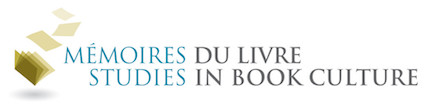
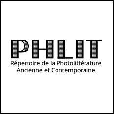
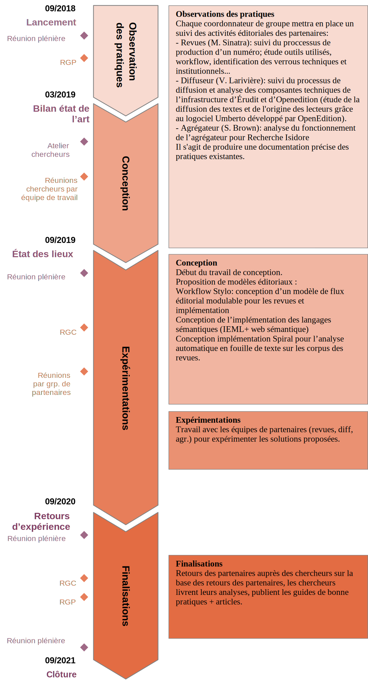

### Publishing practices in scholarly journals : Preliminary results

_Pratiques éditoriales des revues savantes -  
résultats préliminaires du projet Revue 2.0_

Nicolas Sauret, Juliette De Maeyer,  
Jeanne Hourez, Margot Mellet, Servanne Monjour, Marcello Vitali-Rosati
<!-- .element: style="font-size:1.8rem" -->

_CCA Annual Conference 2019 / Colloque annuel AAC 2019_  
2019 June, 1-6 | UBC, Vancouver

<!-- .element: style="font-size:1.5rem" -->

---

slides: [nicolassauret.net/s_Revue20Vancouver](http://nicolassauret.net/s_Revue20Vancouver)

<!-- .element: style="font-size:1.5rem" -->

===

Je vous présente les premiers résultats de l'observation des pratiques éditoriales de 6 revues de SHS menées dans le cadre du projet de recherche Revue 2.0.

%%%%%%%%%%%%%%%%%%SECTIONmoveRight%%%%%%%%%%%%%%%%%%
## Summary

1. _Revue 2.0_
2. Methodology
3. Projections

===

1. i will spent 5 minutes to present the project and the context in which falls our observation of journal publishing practices I'm gonna present.

2. This observation is the phase 1 of the project. I will present briefly our methodology

3. then some Preliminary Results - which are more like projections through which we may elaborate latter on to prepare the seconde phase of experimentations.

§§§§§SLIDEmoveDown§§§§§
<!-- .slide: data-background-image="graphics/equipeecrinum.png" data-background-size="contain" -->
<!--  .slide: class="hover"-->

## Team work / _un travail d'équipe_ <!-- .element: style="padding-top:0.8em" -->

===
le projet Revue 2.0 est dirigé par Marcello Vitali Rosati et porté par sa chaire de recherche sur les écritures numériques.

C'est donc comme d'habitude un travail d'équipe.

%%%%%%%%%%%%%%%%%%SECTIONmoveRight%%%%%%%%%%%%%%%%%%
## _Revue 2.0_

&nbsp;

<i class="fa fa-arrow-right"></i>  [revue20.org](http://revue20.org)

&nbsp;

 <!-- .element: class="logo" style="height:50px; background-color:ghostwhite;padding: 4px" -->
 <!-- .element: class="logo" style="width:20%; background-color:ghostwhite;padding: 4px" -->

§§§§§SLIDEmoveDown§§§§§
### R20 - Objectives

&nbsp;

- <i class="fa fa-arrow-right"></i>  epistemological models / _modèles épistémologiques_
- <i class="fa fa-arrow-right"></i>  publishing models / _modèles éditoriaux_

<!-- .element: style="list-style-type:none;" -->

===
The project Revue2.0 aims at think over the role played by the scholarly journals in the humanities, and at guide the actors of the scholarly publishing into their digital transition.

It has two objectives:

1. to propose an digital compliant epistemological model for scholarly journal in Human Sciences,
2. to propose concrete publishing models, based on tools adapted to the needs and the actual practices.

The main question we are asking with this project is : "what is a journal ?" and "what could be and should be a scholarly journal in the digital environnement"

To answer this question, we retrace the historical mission of the scholarly journals, in order to determine how it can be redefined in the digital era. The digital transition is not only a technical question. Above all, it is an epistemological question which requires to reevaluate the fonctions of publishing. The very act and the meaning of publishing has been renewed with the advent of the world wide web, as global publishing environement.

Publishing gets back to it original meaning : make public. In that case, how does the digital environnement change the way the autority and the scientific legitimacy are produced ?

That will be the first theoritical objective : to think over the epistemological fondations on which human sciences and academic institutions are based.

The second objective will consist in producing specifications addressed to the actors of scholarly publishing (the editors, publishers, curation and diffusion platforms).

What is at stake is the empowerment of those practitionners, the publishers, but also of course the scholars and the authors, towards a digital literacy.

---

Le projet Revue 2.0 vise à repenser le rôle des revues savantes dans les sciences humaines et sociales et à accompagner les acteurs de l’édition scientifique dans leur transition numérique.

Il poursuit deux objectifs :

1. proposer un modèle épistémologique pour les revues savantes en shs adapté à l'environnement numérique.
<!-- Comment alors intégrer une revue, un dossier ou même un seul article dans un écosystème numérique en évolution constante ? Quelles doivent être aujourd'hui les tâches éditoriales, non plus seulement en amont de la publication, mais une fois que la revue a été publiée en ligne, afin de rejoindre les communautés savantes qui se sont formées sur le web ? -->
2. proposer des modèles éditoriaux concrets, avec des outils adaptés aux pratiques, aux cultures et aux besoins.

Fondamentalement, on se posera la question : «qu'est ce qu'une revue ?» «qu'est ce qu'une revue pourrait ou devrait être dans l'environnement numérique.»

Nous essayons de retracer la mission historique des revues savantes, afin de déterminer comment elle peut être redéfinie à l'époque du numérique. La transition numérique n'est pas seulement une question technique. C'est d'abord une question épistémologique qui demande à réévaluer la fonction de l'éditeur. L'acte et le sens même de la publication s'est transformé avec l'avènement du web.

Publier revient à son sens premier : rendre public. Ce nouvel environnement a bouleversé la façon dont se construit l'autorité et la légitimité scientifique.

Et Ce sera le premier objectif théorique du projet de repenser le fondement épistémologique sur lequel repose la science et les institutions académiques.

Pour le second, il s'agira de produire un cahier des charges à destination des différents acteurs de l'édition savante (éditeurs, diffuseurs, agrégateurs).

Il y a là un enjeu de capacitation des praticiens de l'édition, mais aussi des chercheurs et des auteurs, vers une nouvelle littératie numérique.

§§§§§SLIDEmoveDown§§§§§

### R20 - Partenariat

- <i class="fa fa-arrow-right"></i>  journals
- <i class="fa fa-arrow-right"></i>  main francophone diffusion platforms:  Erudit, OpenEdition
- <i class="fa fa-arrow-right"></i>  French agregator and search engine: Isidore.science (Huma-Num)
- <i class="fa fa-arrow-right"></i>  scholars

<!-- .element: style="list-style-type:none;font-size:0.9em" -->

&nbsp;

 <!-- .element: style="height:40px;background:whitesmoke;border:1px" -->
 <!-- .element: style="height:40px;background:whitesmoke;border:1px" -->
<!-- .element: style="height:40px;background:whitesmoke;border:1px" -->
 <!-- .element: style="height:40px;background:whitesmoke;border:1px" -->
 <!-- .element: style="height:40px;background:whitesmoke;border:1px" -->
 <!-- .element: style="height:40px;background:whitesmoke;border:1px" -->
 <!-- .element: style="padding:3px;height:40px;background:whitesmoke;border:1px" -->
 <!-- .element: style="padding:3px;height:40px;background:whitesmoke;border:1px" -->
 <!-- .element: style="padding:3px;height:40px;background:whitesmoke;border:1px" -->

===

The project gathers a interesting partnership :

1. It includes the two main francophone diffusion platforme for human science, OpenEdition and Erudit, as well as the agregator and search engine Isidore Science, dedicated to human sciences, which is a service offered by the french infrastructure Huma-Num.
2. the project mobilze eight scholarly journals, who participate as expert in scholarly publishing, but also as a research field for observation and experimentation of publishing practices. The journals are fully engaged in the research, together with the scholars involved.

---

Le projet rassemble un partenariat particulièrement intéressant :

1. d'une part il intègre les deux principaux diffuseurs francophones en sciences humaines et sociales, OpenEditions et Erudit, ainsi que Human-num avec son service Isidore qui offre un moteur de recherche spécialisé pour les SHS
2. d'autre part, le projet mobilise 8 revues partenaires, qui participent 1) en tant qu'expert de l'édition scientifique, mais aussi 2) en tant que terrain d'observation et d'expérimentation. Les revues sont donc engagées avec nous dans la recherche, aux côtés des co-chercheurs du projet.

§§§§§SLIDEmoveDown§§§§§

### R20 - Theoritical trails / _Pistes théoriques_

&nbsp;

- <i class="fa fa-arrow-right"></i>  public space / _espace public_
- <i class="fa fa-arrow-right"></i>  conversation / _conversation_

<!-- .element: style="list-style-type:none;" -->

===

The environnement in which we read, write and publish has been radically transformed. The digital environnement produces a totaly different space structure, impacting how the autority is produced. Publishing, and more precisely the "Editorialization", a concept coined by Marcello Vitali Rosati (and others), are the very process of space production, and not only the digital space, since maintaining this distinction does not make anymore sense.

One of the theoritical orientation is that the journal, as a publishing and editorialisation practice, is an opportunity to retrieve the public space, not only by opening the scientific conversation to the society, but rather by creating new forms of public space. And that's what we will explore during this project, together with the journals.

A second theoritical trail is the conversation. We draw from the analysis that the great scientific conversation occurs in alternatives spaces : blogs, social networks, curation plateforms, maillist, etc. Those spaces are not recognized as such by the academic institutions. This activity is kept mainly of the radar of the institution. Our hypothesis is that journal could develop a conversationnal publishing model, which would force the institutions to recognize different writing and publishing practices, and therefore to welcome back those alternative contributions.

---

Nous l'avons vu, en modifiant les mécanismes de l'autorité, c'est en fait la structure de l'espace qui est transformé. L'édition et l'éditorialisation se trouve au coeur des processus de production de l'espace, et pas seulement de l'espace numérique.

Une de nos pistes théoriques est donc que la revue a l'opportunité de réinvestir l'espace public, pas seulement dans une dynamique d'ouverture, des cercles académiques vers des cercles élargis, mais surtout en réinventant des formes d'espaces publics.

Une seconde piste théorique, est celle de la conversation. A partir du constat que la grande conversation scientifique s'opère aujourd'hui davantage dans des espaces alternatifs, les blogs, les réseaux sociaux, les listes de diffusions, notre hypothèse est celle d'un modèle éditorial conversationnel.

§§§§§SLIDEmoveDown§§§§§

|time periods  | phases   |
|:--|:--|
|Oct. 2018    | Launching  |
|Oct. 2018 - June 2019 | Observing |
|June-Dec. 2019 | Designing |
|Jan. 2020 - Sept. 2020 | Experimenting |
|Sept. 2020 - Sept. 2021 | Conclusion |

<!-- .element: style="font-size:0.5em; margin:10rem 20px 0 0; width:40%; float:left;" -->

<!-- .element: style="background-color:ghostwhite; padding:0.1rem 0.3rem;height:40rem;" -->

<!-- .element: style="width:40%;  float:left;" -->

===

The project will last 3 years. We divided the time in 3 main phases : observation of publishing practices, designing the journal protocols, tools and models, which will be experimented by the partners in the 3rd phase.

---

le projet dure 3 ans. Nous l'avons découpé en 3 phases : observations des pratiques éditoriales de nos partenaires, conceptions de protocoles éditoriaux, d'outils, de modèles, qui seront ensuite expérimentés dans la 3eme phase.

%%%%%%%%%%%%%%%%%%SECTIONmoveRight%%%%%%%%%%%%%%%%%%
### Phase 1 - practices observation / _Observation des pratiques_

===

We started in October last year.

The first phase of the project was dedicated to observe the practices of the journals and more specificaly to describe their publishing process. The objective of this description was to understand the epistemological model on which rely the work in the journal : what are the communication channels ? what are the technical and editorial artefacts producing autority ? in other words, who legitimate, and how ?

§§§§§SLIDEmoveDown§§§§§
### P1 - Methodology / _Méthodologie_

&nbsp;

- <i class="fa fa-arrow-right"></i>  collecting documents / _récolte de documents_
- <i class="fa fa-arrow-right"></i>  online survey / _questionnaire_
- <i class="fa fa-arrow-right"></i>  interviews / _entretiens_
- <i class="fa fa-arrow-right"></i>  genetics of an article / _génétique d'un article_

<!-- .element: style="list-style-type:none;" -->

===

The observation articulates around 4 activities :

1. The collect of every document produced or used during the publishing process
2. an online survey in which we try to determine who are the actors of the process : as much the human actors as the diff. tools and apparatus. This questionnaire, together with the collected documents, allowed us to precisely modelise the publishing process for each journal.
3. third activities, the interviews lead with the editors and the directors of the journal. They were usefull to identify the needs and problems of the journals, and to understand where really occurs the production of autority and legitimacy.
4. Finally, we will make use of all the data to produce a sort of genetics or genesis of an article, by modelising its life cycle, from its writing and submission to its diffusion.

---

Nous avons démarré en oct 2018.

La première phase du projet consiste à aller observer les pratiques des différents partenaires et en particulier à décrire le processus éditorial des revues. Cette description a pour objectif de comprendre le modèle épistémologique sous-jacent au fonctionnement des revues en SHS : quelles sont les voies de communication ? quels sont les artefacts technique ou éditoriaux participant à la construction de l'autorité ? pour le dire autrement, qui légitime, et comme se construit la légitimité de ce qui ?

Cette phase mobilise les revues partenaires autour de quatre activités :

1. la récolte de tous les documents qui sont produits ou utilisés pendant le processus éditorial de la revue
2. un questionnaire dans lequel on va chercher à préciser d'un point de vue technique et pratique quels sont les acteurs de ce processus, tant les acteurs humains que les dispositifs et outils utilisés. Ce questionnaire associé aux documents livrés nous permettra de modéliser précisemment le processus éditorial de chaque revue,
3. des entretiens avec les secretaires de rédaction et les directeurs et directrices de revue. Dans ces entretiens, l'on cherchera, à partir de la modélisation précise du processus éditorial, à identifier les problématiques des revues, à pointer les éléments saillants en terme d'autorité et de légitimation.
4. enfin, nous exploiterons les données obtenues pour tenter une génétique d'un article, cad reconstruire son cycle de vie, depuis la rédaction et la soumission d'un article par un auteur jusqu'à sa diffusion.

§§§§§SLIDEmoveDown§§§§§
<!-- .slide: data-background-image="./img/modelisationItineraires.png" data-background-size="contain" -->
<!--  .slide: class="hover"-->

### Ph1 - Preliminary Results / _Résultats préliminaires_

===

the quantity of data is consequent, not yet big data though, but we definitely have serious modeling and analysis ahead of us.

Instead of going in the detail of each publishing process modelisation, I chose to present several projections that came out from the interviews and for each I will propose an interpretation to orient the next phase of the project.

%%%%%%%%%%%%%%%%%%SECTIONmoveRight%%%%%%%%%%%%%%%%%%

### there is no model

- <i class="fa fa-arrow-right"></i>  diversity of models
- <i class="fa fa-arrow-right"></i>  multiplicity of epistemological regime

===

Despite the similarities of tools, apparatus, general process, there is no such thing than a unique publishing model in human science. In contrary the diversity of the publishing process is remarkable from one journal to another.

All journal have an scientific and an editorial committee, internal and external reviewers, issue directors, they all procede to similar evaluation and reviewing, reference verification, proof reading, they all edit, structure and validate their document, putting the same attention to produce the best papers they can, etc.

However, what differentiate the journals is the value they will put in each of those aspects of the production.

Therefore what we can conclude from this diversity of model, is that the autority and the legitimacy do not emerge in the same way from one journal to another.

There is a multiplicity of epistemological regim.

§§§§§SLIDEmoveDown§§§§§

### constant negociation

- <i class="fa fa-arrow-right"></i>  negociating the ideal
- <i class="fa fa-arrow-right"></i>  twisting the protocol

===

Another interesting and recurrent aspect is the constant negociation the different actors are performing during the process. What do they negociate with ?

They constantly negociate the ideal model they pretend to follow, their own protocol supposed to ensure the scientificity of the journal. This is a very interesting outputs from the interviews. From the generic documents and the survey, we were able to draw quite a precise workflow of each journal process, which allowed us to locate where the decision were made.

However, the interviews showed us that at every step of the workflow, the reality takes over the ideal, and that the decisions to select, refuse or authorize an article are eventually made through a serie of discussions that come twisting the declared protocol.

Definitely in Human Science, rules are made to be transgressed, but this is no surprise. Who really believe that humanities could be quantified and modelised....? this is a joke.

Or maybe humanities are all about debate and conversation, and requires constant critical thinking above research protocols.

§§§§§SLIDEmoveDown§§§§§

### Internal / external

- <i class="fa fa-arrow-right"></i>  authors
- <i class="fa fa-arrow-right"></i>  reviewers
- <i class="fa fa-arrow-right"></i>  issue directors

===

There is a particularly notable tension between what is considered internal or external to the journal, that tells a lot about the journal.

how do the individual involved in the daily life of the journal consider the issue directors, the reviewers, the authors ? According to the interviews, those contributors are let outside the journal and are not incorporated in the journal core family.

This tension occurs on different levels of the editorial process and addresses different actors.

From one journal to another, the reviewing experts for instance could be 1) "friends", aware of the editorial policy of the journal and knowing what is expected, 2) or could be authors that have already published, or in contrary  3) strangers, with no precedent relation to the journal, like for the journal Intermedialités.

[Axes sur les reviewers]

We often perceive a journal as a community, made of a scientific committee, an editorial team, readers, regular authors, reviewers, issue directors, nonetheless, this community is split into the inner family and the external world. Our discussion with the journal directors showed us that this distinction is maintained in purpose, drawing from the belief that the fewer porosity there is between the journal and the external, the better the journal can maintain its scientificity.

In particular, in the case of the issue director: how much she is involved in the evaluation and decision process, her degree of autonomy, the degree of collaboration with the committee. It can be used to caracterize the porosity between the internal and the external, and to go further, to categorize the journal, in categories of publishing models that are yet to be defined.

[Axes sur les issues directors collaboration / autonomie ]

§§§§§SLIDEmoveDown§§§§§

### evaluation and legitmation

- <i class="fa fa-arrow-right"></i>  decision process
- <i class="fa fa-arrow-right"></i>  decision makers

===

Let's illustrate the precedent assessments with what we observed in terms of evaluation and legitimation.

Where is the authority located ? what produces it ? what, in the the editorial protocol, legitimates the article, the author, or more generally the journal itself ?

When we interviewed the individual, it was rather obvious that the legitimation is not an _exact_ science. It results from a multiplicity of decision makers, enacting their function all along the protocol. For each journal, those decisions are not of the same nature, do not have the same value, and are not occurring in the same steps.

For instance, Etudes Françaises focuses its selection on the overall issue proposal, that is brought first to the journal with all the articles ready to be reviewed and edited. The first step in the process is the selection (or not) of the issue, the decision is taken internally and, according to the journal director we interviewed, this decision first legitimates the issue problematic.

Another instance of legitimation is directly linked to the reviewing process. The journals traditionnally have internal reviewing and external reviewing. But the legitimacy put into the reviewing won't be the same if you take into account how and who validates the reviewing, whether the reviews are transmitted to the authors or not, whether they are filtered or edited by the committee during the process.

For instance, the external reviews of the journal Intermedialités are in general taken in face value, and the reviewers anonymity is kept intact during the whole process, even for the committee. The legitimacy value is therefore vers high. On the contrary, committees of other journals, sometimes aware of the reviewers identity, sometimes not, will actively counterbalance the external reviews. It proceeds by internal discussion, or by internal reviews (which can be single blind, which can be open review). Depending on the journal, the decision is eventually made, based on the internal review or from the internal discussion of the committee.

And as we have discussed earlier, the neutralization of external reviews may also include the issue director's opinion, which complexifies the decision process, but most importantly, by opening this process, it also reduces the value put into the external review.

Therefore, despite of the shared reviewing process, we conclude that the legitimating authority will not locate at the same place from one journal to another.

---

Une autre légitimation est évidemment liée à l'évaluation, dont on distingue l'évaluation interne ou externe. Mais cette légitimité de l'évaluation ne prend véritablement sens que lorsqu'on considère qui valide les évaluations, et comment. Et l'on se rend compte ainsi, d'un journal à l'autre, que les évaluations n'ont pas du tout la même valeur de légitimation.

Par exemple, les évaluations externes dans la revue Intermédialités sont généralement prises au pied de la lettre, et l'anonymat des évaluateurs demeurent tout au long du process. Leur valeur de légitimation est alors très haute. Au contraire, sur d'autres revues, le comité va pouvoir contrebalancer les évaluations externes par des discussions internes en comité (le comité peut alors connaitre ou non l'identité des évaluateurs), par des évaluations internes, elles aussi pouvant être soit en simple aveugle (l'auteur est anonymisé), soit de manière ouverte (l'évaluateur connait le nom de l'auteur). Selon la revue, sera considéré comme décisive l'évaluation interne ou encore, la discussion interne du comité.
La décision peut encore se complexifier avec l'intégration du directeur de dossier dans la négociation.

Ainsi, malgré ce schéma constant d'évaluation externe, parfois interne, l'instance de légitimation ne se situe pas au même endroit d'une revue à l'autre.

§§§§§SLIDEmoveDown§§§§§

### Digital / conversation

- <i class="fa fa-arrow-right"></i>  increasing the reach
- <i class="fa fa-arrow-right"></i>  loosing symbolic capital

===

Another issue that we brought up during the interviews is the impact of the Digital in the publishing practices.

The first result is that for the majority of editors and directors, digital is all about diffusion, and not much else. They insist on the fact that publishing online increased their reach to more readers, even if this augmentation came together with a lost of control of who and where those readers are. Indeed, The diffusion platform such as Erudit or OpenEdition are not able to report properly the usage. Whereas the paper diffusion used to go through direct subscription to the papers allowing a human and institutional contact that is lost nowadays with diffusion platforms.

This lost is first of all a symbolic lost. Journal directors have this feeling that some symbolic capital has gone away from the fact that they don't know anymore whether if the Bodleian Libraries of Oxford have their issues on their desks, or whether the Moma is still buying their online version.

if we listen to the editor and director, digital changed nothing on the editor work. They edited in Microsoft Word before their journal was put online, and still do, adding absolutely no data value into their content, letting the diffusion plateform process and edit all the metadata.

Yet, we know very well that the access to article and journal is now mainly going through search engine. Metadatas are therefore the main mean to access and reach an article in the ocean of scientific publications.

We consider there is a major breach here in the scientific work of the scholarly journal, eventhough the platforms are taking the metadata aspect seriously. The journal are not in control of their own data, on how they appear in the web. They put so much value in the text of the article, and so few in presenting this text in a coherent manner for the search engine.

%%%%%%%%%%%%%%%%%%SECTIONmoveRight%%%%%%%%%%%%%%%%%%
### Merci !

<i class="fa fa-arrow-right"></i> [revue20.org](http://revue20.org)

<!-- .element: style="font-size:0.7em;" -->

---
 <!-- .element: class="logo" style="width:25%; background-color:ghostwhite;padding: 7px" -->

